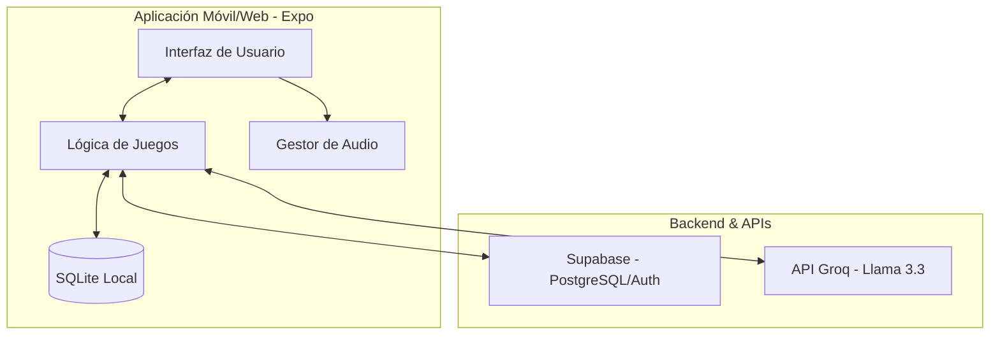
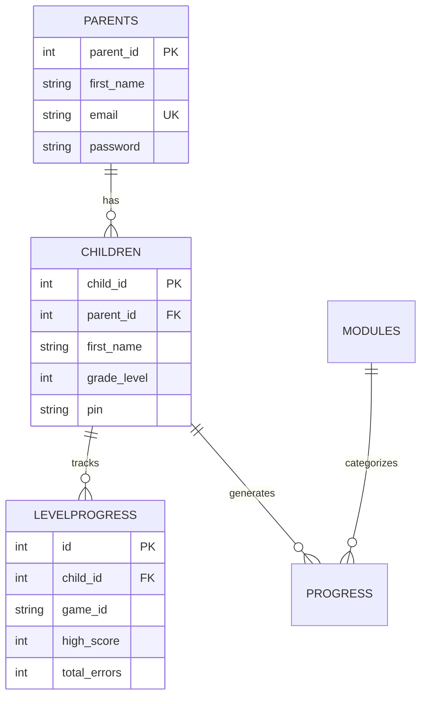
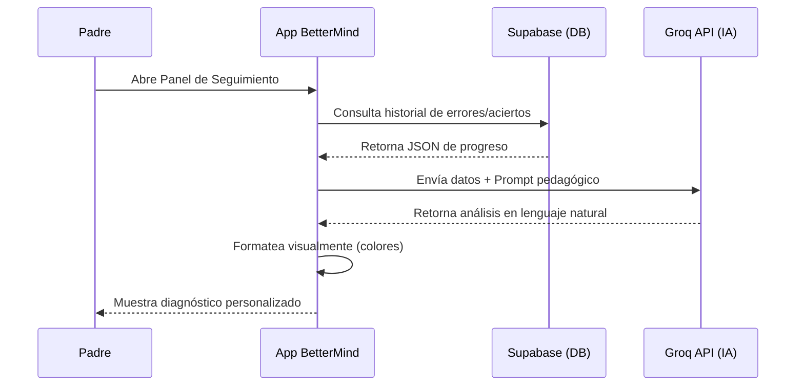

# Manual Técnico - BetterMind

## 1. Arquitectura del Sistema y Patrones de Diseño

### Arquitectura General
**BetterMind** sigue una arquitectura **Cliente-Servidor** basada en servicios en la nube (Backend as a Service - BaaS).



- **Cliente**: Aplicación desarrollada con **React Native** y **Expo**...
### Patrones de Diseño
1.  **MVC (Modelo-Vista-Controlador)**: 
    - **Modelo**: Definido en `app/utils/database/schema.ts` y las tablas de Supabase.
    - **Vista**: Componentes de React Native en la carpeta `app/` y `components/`.
    - **Controlador**: Lógica de hooks personalizados y funciones en `app/utils/` que median entre la vista y los datos.
2.  **Singleton**: El `sound-manager.ts` implementa este patrón para asegurar que solo exista una instancia del gestor de audio, evitando conflictos de reproducción de música y efectos.
3.  **Context Pattern**: Implementado en `auth-context.tsx` para proveer el estado de autenticación de forma global sin necesidad de "prop drilling".
4.  **Adapter Pattern**: El archivo `adapter.ts` actúa como un adaptador para la base de datos, permitiendo que la aplicación funcione tanto con SQLite en dispositivos móviles como con almacenamiento persistente en la web de forma transparente.

---

## 2. Stack Tecnológico

### Frontend
- **React Native (Expo SDK 51)**: Elegido por su capacidad de despliegue multiplataforma con un solo código base y su gran ecosistema de librerías.
- **TypeScript**: Proporciona tipado estático, lo que reduce errores en tiempo de ejecución y mejora la mantenibilidad del código.
- **Expo Router**: Sistema de navegación basado en archivos que simplifica la estructura de rutas de la aplicación.
- **Expo AV**: Para el manejo eficiente de audio y efectos sonoros.

### Backend y Persistencia
- **Supabase (PostgreSQL)**: Se eligió como motor principal por su escalabilidad, soporte nativo de JSONB para datos flexibles y su capa de seguridad integrada (RLS).
- **SQLite (expo-sqlite)**: Utilizado para la persistencia local en dispositivos móviles, permitiendo que la aplicación mantenga datos de sesión y progreso incluso con conectividad limitada.

### Dependencias Principales y Propósito
Para que el proyecto funcione correctamente, se han integrado las siguientes librerías clave:

| Dependencia | Propósito |
| :--- | :--- |
| `expo` | Framework base para el desarrollo multiplataforma. |
| `@supabase/supabase-js` | Cliente oficial para la integración con la base de datos y autenticación en la nube. |
| `expo-sqlite` | Motor de base de datos local para persistencia offline y caché. |
| `expo-av` | Gestión de audio (música de fondo y efectos de sonido de juegos). |
| `expo-router` | Sistema de navegación basado en archivos (File-based routing). |
| `react-native-safe-area-context` | Manejo de áreas seguras (muescas/notches) en dispositivos móviles modernos. |
| `@react-native-async-storage/async-storage` | Almacenamiento de clave-valor para configuraciones rápidas y tokens. |
| `@react-native-community/slider` | Componente de control para la configuración de volumen y parámetros de juegos. |
| `expo-crypto` | Generación de hashes y manejo seguro de datos sensibles localmente. |
| `expo-font` | Carga y gestión de tipografías personalizadas para la interfaz didáctica. |

### Inteligencia Artificial
- **Groq Cloud (Llama 3.3)**: Implementado para ofrecer diagnósticos rápidos y gratuitos. Su baja latencia es crítica para la experiencia de usuario en el panel de padres.

---

## 3. Modelamiento de Datos y Persistencia

### Diagrama Entidad-Relación (Lógico)
El sistema se organiza en torno al núcleo de usuarios (Padres e Hijos) y su progreso en los módulos educativos.



- **Parents**: Almacena credenciales...
### Diccionario de Datos

#### Tabla: `parents`
| Campo | Tipo | Restricción | Descripción |
| :--- | :--- | :--- | :--- |
| `parent_id` | SERIAL | PK, NOT NULL | Identificador único del padre. |
| `first_name` | TEXT | NOT NULL | Nombre del padre/tutor. |
| `email` | TEXT | UNIQUE, NOT NULL | Correo electrónico (identificador de login). |
| `password` | TEXT | NOT NULL | Contraseña (almacenada mediante hash). |

#### Tabla: `children`
| Campo | Tipo | Restricción | Descripción |
| :--- | :--- | :--- | :--- |
| `child_id` | SERIAL | PK, NOT NULL | Identificador único del niño. |
| `parent_id` | INTEGER | FK, NOT NULL | Referencia al padre (ON DELETE CASCADE). |
| `first_name` | TEXT | NOT NULL | Nombre del niño. |
| `grade_level` | INTEGER | NOT NULL | Grado escolar (1° a 9°). |
| `pin` | TEXT | - | Código de seguridad para acceso parental. |

#### Tabla: `levelprogress`
| Campo | Tipo | Restricción | Descripción |
| :--- | :--- | :--- | :--- |
| `id` | SERIAL | PK, NOT NULL | Identificador de registro. |
| `child_id` | INTEGER | FK, NOT NULL | Referencia al niño. |
| `game_id` | TEXT | NOT NULL | Identificador técnico del minijuego. |
| `high_score` | INTEGER | DEFAULT 0 | Puntaje máximo alcanzado. |
| `total_errors` | INTEGER | DEFAULT 0 | Acumulado de errores para análisis de IA. |

---

## 4. Especificación y Documentación de la API

### Estándar de Comunicación
La aplicación utiliza una arquitectura **REST** para la comunicación con Supabase y la API de Groq.

### Catálogo de Endpoints Principales (Supabase)
*Supabase genera automáticamente estos endpoints basados en el esquema:*

- **POST `/auth/v1/signup`**: Registro de nuevos padres.
- **POST `/auth/v1/token`**: Autenticación y obtención de JWT.
- **GET `/rest/v1/children`**: Obtiene la lista de niños asociados al usuario autenticado.
- **PATCH `/rest/v1/children?child_id=eq.X`**: Actualiza datos del perfil del niño.
- **POST `/rest/v1/levelprogress`**: Registra un nuevo puntaje tras finalizar un juego.

### Integración de IA (Groq)
- **Endpoint**: `https://api.groq.com/openai/v1/chat/completions`
- **Método**: `POST`
- **Cuerpo (Request)**:
  ```json
  {
    "model": "llama-3.3-70b-versatile",
    "messages": [
      {"role": "system", "content": "Prompt pedagógico..."},
      {"role": "user", "content": "Datos de progreso del niño..."}
    ]
  }
  ```
- **Respuesta**: Objeto JSON con la recomendación pedagógica y clasificación de observaciones (positivas, negativas, neutrales).

---

## 5. Diagramas de Modelado de Software (UML)

### Diagrama de Casos de Uso
- **Actores**: Padre, Niño, Sistema de IA.
- **Casos de Uso Críticos**:
  - **Niño**: Jugar minijuego, ver progreso, desbloquear niveles.
  - **Padre**: Crear perfil de hijo, consultar diagnóstico de IA, gestionar PIN.
  - **Sistema de IA**: Analizar errores, generar recomendaciones.

### Diagrama de Secuencia (Proceso de Diagnóstico)
Este flujo describe la interacción entre el usuario, la aplicación, la base de datos y el motor de IA.



---

## 6. Guía de Instalación y Despliegue

### Prerrequisitos
- **Node.js**: v18.x o superior.
- **npm** o **yarn**.
- **Expo Go** (en el dispositivo móvil para pruebas).
- **Cuenta en Supabase** y **Groq Cloud**.

### Instrucciones paso a paso
1. **Clonar el repositorio**:
   ```bash
   git clone https://github.com/usuario/bettermind.git
   cd bettermind
   ```
2. **Instalar dependencias**:
   ```bash
   npm install
   ```
3. **Configurar variables de entorno**:
   Crear un archivo `.env` en la raíz con:
   ```env
   EXPO_PUBLIC_SUPABASE_URL=tu_url_de_supabase
   EXPO_PUBLIC_SUPABASE_ANON_KEY=tu_clave_anon_de_supabase
   EXPO_PUBLIC_GROQ_API_KEY=tu_api_key_de_groq
   ```
4. **Ejecutar migraciones**:
   Copiar el contenido de `supabase_schema.sql` y ejecutarlo en el SQL Editor del dashboard de Supabase.
5. **Iniciar el servidor de desarrollo**:
   ```bash
   npx expo start
   ```

---

## 7. Pruebas de Software (QA) y Calidad

### Estándares de Código
- **Linters**: Se utiliza **ESLint** con la configuración recomendada para React Native para asegurar la consistencia del código.
- **Formateadores**: **Prettier** para el estilo visual del código.
- **Tipado**: **TypeScript** estricto para evitar errores de asignación de datos.

### Matriz de Pruebas Técnicas (Resumen)
| ID | Prueba | Entrada | Resultado Esperado |
| :--- | :--- | :--- | :--- |
| T01 | Registro de Padre | Email válido, pass fuerte | Creación de registro en `parents`. |
| T02 | Sincronización de Puntaje | Fin de juego (Score: 100) | Actualización de `high_score` en Supabase. |
| T03 | Análisis de IA | Historial de errores alto | Diagnóstico que priorice áreas de mejora. |
| T04 | Seguridad de PIN | PIN incorrecto | Bloqueo de acceso al panel parental. |

---

## 8. Seguridad y Normativa Colombiana

### Mecanismos de Seguridad
- **Cifrado en Tránsito**: Todas las comunicaciones se realizan sobre **HTTPS**.
- **Seguridad de Datos (RLS)**: Se implementaron políticas de **Row Level Security** en Supabase, asegurando que un padre solo pueda ver los datos de sus propios hijos.
- **Protección de PIN**: Los perfiles sensibles requieren un PIN de 4 dígitos que no se almacena en texto plano en la sesión activa.

### Cumplimiento Ley 1581 de 2012 (Protección de Datos)
BetterMind cumple con la normativa colombiana mediante:
1. **Finalidad Definida**: Los datos recolectados (nombres, grado escolar) tienen el único propósito de personalizar la experiencia educativa.
2. **Acceso Restringido**: Solo el tutor legal (Padre) tiene acceso a los datos de progreso del menor.
3. **Derecho de Supresión**: El sistema permite la eliminación de perfiles de niños, borrando en cascada toda la información asociada de los servidores.
4. **Seguridad Técnica**: Uso de tokens **JWT** con tiempo de expiración para evitar accesos no autorizados.
